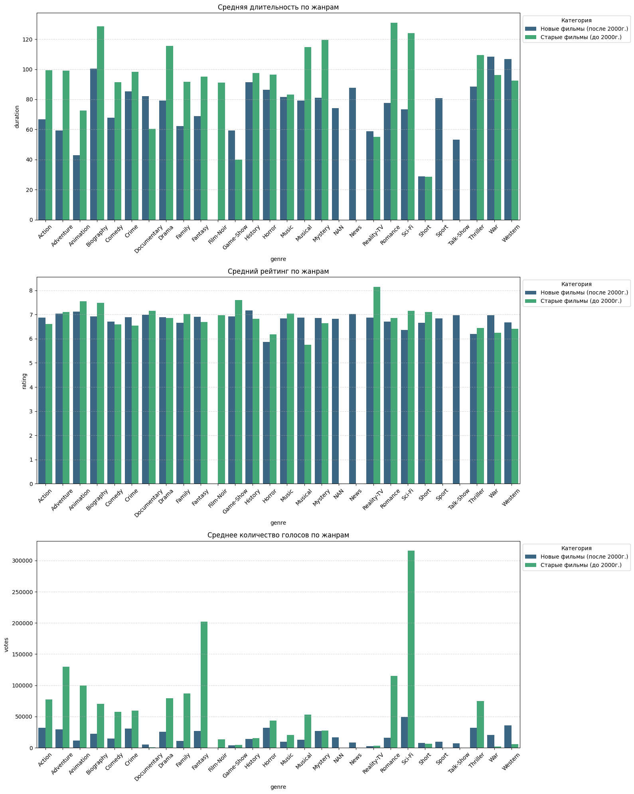
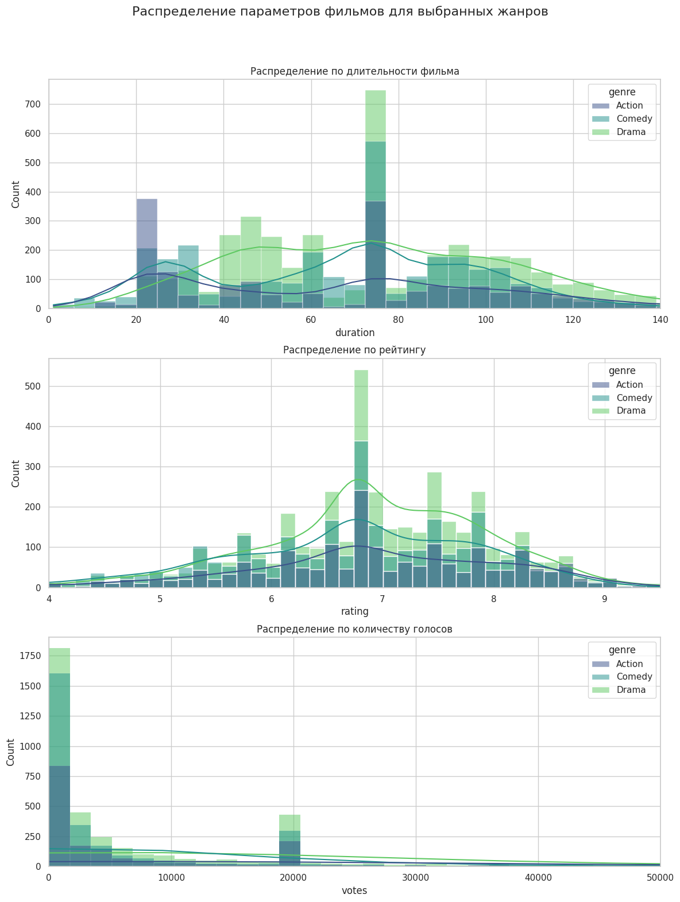
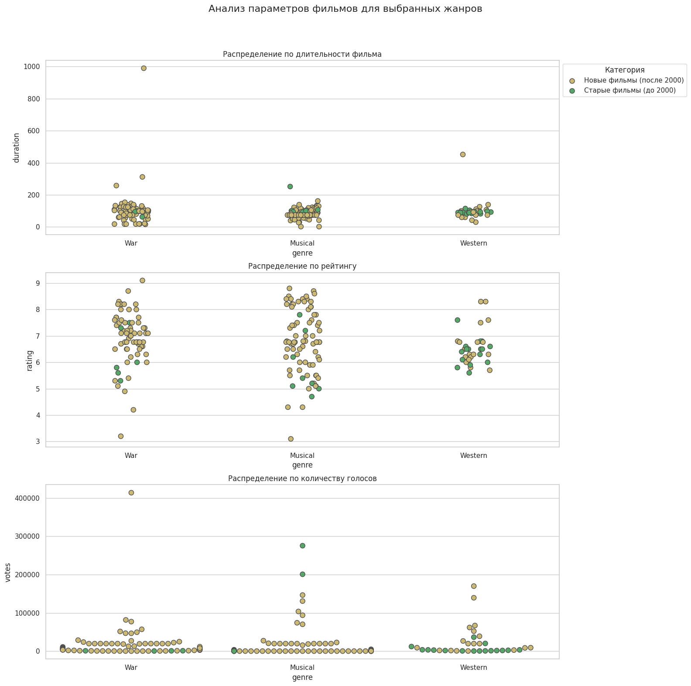
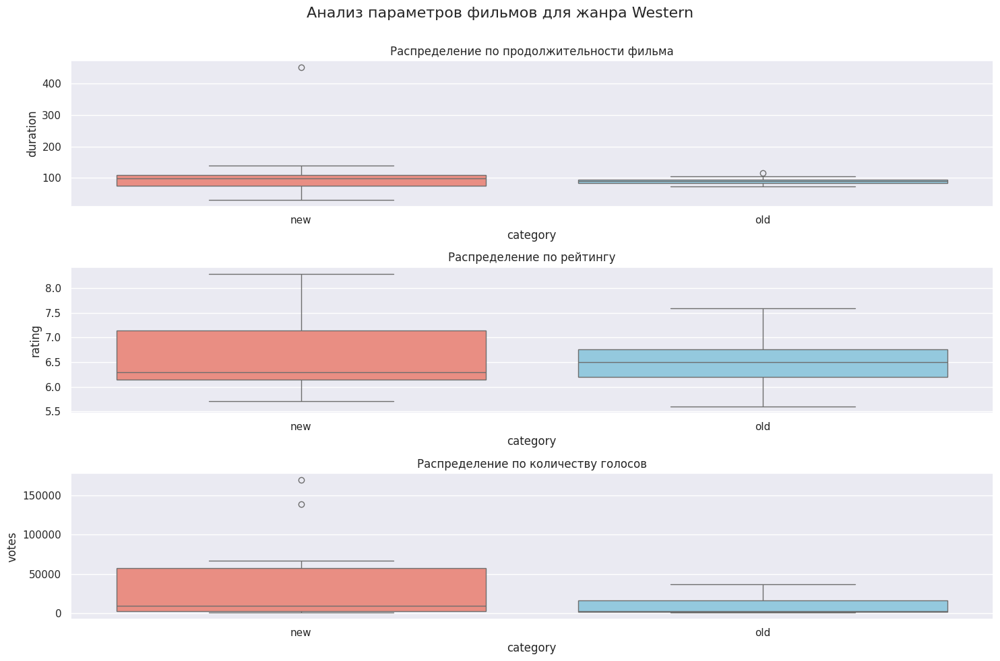
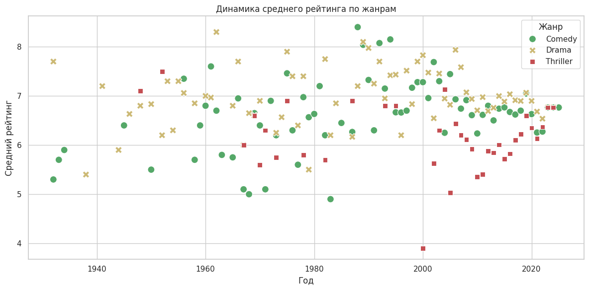
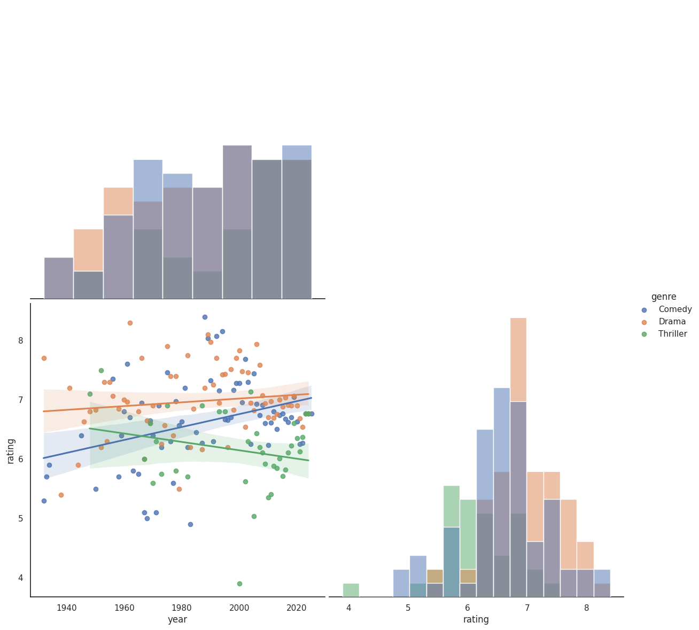
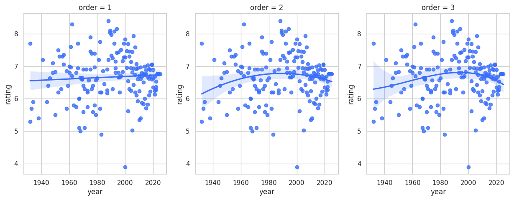
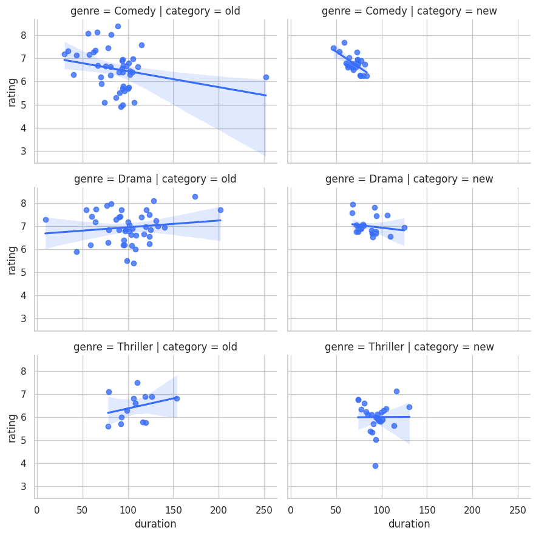

# 📊 IMDB_Data_Analysis

Educational project on exploratory data analysis (EDA) of IMDB movies dataset.  
Учебный проект по разведочному анализу данных (EDA) датасета фильмов IMDB.

---

## 📌 About / О проекте

🎓 Completed as part of a course assignment on data visualization and EDA.  
📦 Demonstrates data cleaning, preprocessing, and multi-faceted visualization.  
💡 Explores distributions, dependencies, and patterns in movies data (genre, year, rating, votes, duration, certificate).  

🎓 Выполнено в рамках курса по визуализации данных и разведочному анализу.  
📦 Показаны этапы очистки, предобработки и многоуровневой визуализации.  
💡 Исследованы распределения, зависимости и закономерности в данных о фильмах (жанр, год, рейтинг, количество голосов, длительность, сертификат).  

---

## 📝 Tasks / Задания

### 🔹 Data preprocessing / Предобработка данных
- Заполнение пропусков:  
  - `certificate` — мода  
  - `duration`, `rating`, `votes` — среднее значение  
- Очистка строковых данных: удаление лишних символов, перевод в числовой формат  
- Разделение жанров на отдельные значения  

### 🔹 Visualization / Визуализация данных
- Круговая диаграмма по сертификатам  
- Столбчатая диаграмма по сертификатам  
- Гистограмма по годам выпуска фильмов  
- Средняя длительность, рейтинг и количество голосов по жанрам для старых и новых фильмов  
- Распределения параметров (`duration`, `rating`, `votes`) для выбранных жанров  
- Boxplot для сравнения старых и новых фильмов по ключевым параметрам  

### 🔹 Outlier detection / Поиск выбросов
- Примеры фильмов с аномально большой длительностью  

### 🔹 Insights / Выводы
- Старые фильмы обычно короче и имеют меньшее количество голосов  
- Жанровая специфика влияет на среднюю длительность и рейтинг  
- Количество голосов часто сильно разнится и имеет выбросы  

---

## 🔧 Tools & Libraries / Инструменты и библиотеки

- **pandas** — обработка и очистка данных  
- **numpy** — числовые операции  
- **matplotlib.pyplot** — визуализация графиков  
- **seaborn** — визуализация распределений и сравнений  
- **plotly.express** — интерактивные графики (гистограмма по годам)  
- **re** — работа с регулярными выражениями  

---

## 📁 Structure / Структура проекта

- **MultiDataVisualization_LW5** — Jupyter notebook с кодом:  
  - Загрузка и обзор данных  
  - Очистка и преобразование данных  
  - Визуализация и анализ  
  - Выводы по графикам и общий вывод  

- **images/** — папка для скриншотов некоторых графиков 

---

## 🖼 Screenshots / Скриншоты

*Рис. 1*

*Рис. 2*

*Рис. 3*

 
*Рис. 4*

*Рис. 5* 

*Рис. 6 — Линейные регрессии*

 
*Рис. 7 — Регрессионные кривые разных степеней*

*Рис. 8 — Графики с трендами* 
  
---
